<div align="center">

# ◆ DHI

**The agentic workspace IDE — in your terminal.**

A keyboard-first IDE where you and a crew of AI agents share one workspace:
a board, channels, an editor, a review screen, all in one terminal window.

[](https://github.com/drjzlyan/dhi/actions/workflows/ci.yml)
[](https://github.com/drjzlyan/dhi/releases)
[](go.mod)
[](LICENSE)

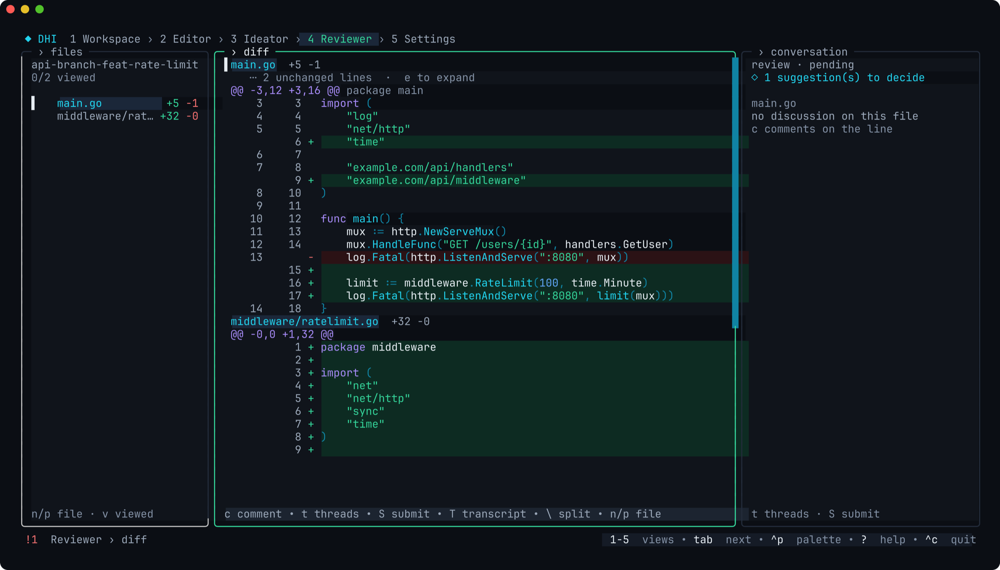

</div>

## Why DHI

You ask agents for work in one window, review what they did in another, and
track it all somewhere else. DHI puts it in one place, inside the editor you
already work in:

- **A team, not a chat box.** Agents have names, roles, skills and memory.
  Assign them cards on a board, @-mention them in channels, or pair with
  one in a buffer.
- **Review that feels like a real review.** Every change lands in its own
  git worktree. You get a three-column diff, word-level highlights, agent
  suggestions you accept or dismiss, and one GitHub review sent as you.
- **Many repos, one workspace.** Navigate, search and replace across every
  member repo at once; changes that span services stay linked.
- **Your keyboard, your rules.** Vim-style editing, a command palette for
  everything, and every key shown where you need it. The mouse works too.
- **Nothing to install around it.** DHI brings its own pinned Go, Node, git,
  ripgrep and GitHub CLI under one folder. No sudo, and your system
  toolchain is never touched.
- **Fits any window.** Every screen adapts from a narrow split to an
  ultrawide monitor and is tested at each size.

## A look around

| Board and agents | Channels |
|---|---|
| 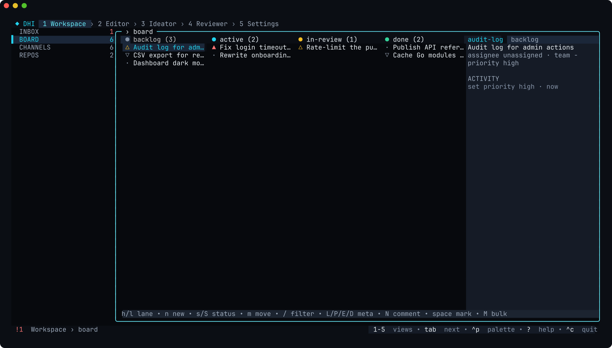 | 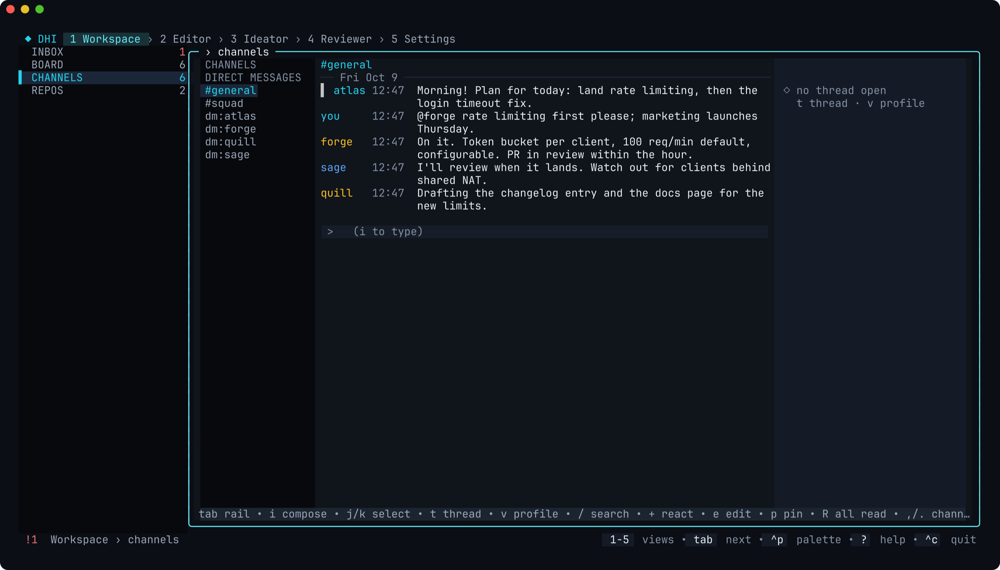 |
| **Inbox: what needs you** | **Dialogs stay in their box** |
| 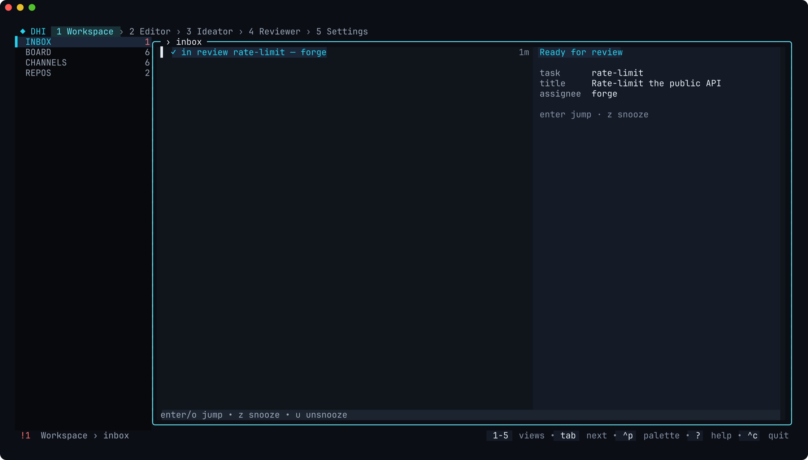 | 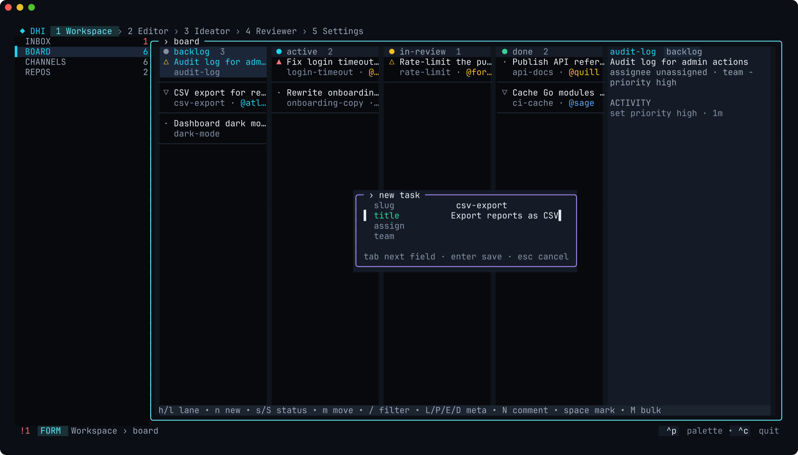 |
| **Editor: file tree and split panes** | **A real terminal, one tab per repo** |
| 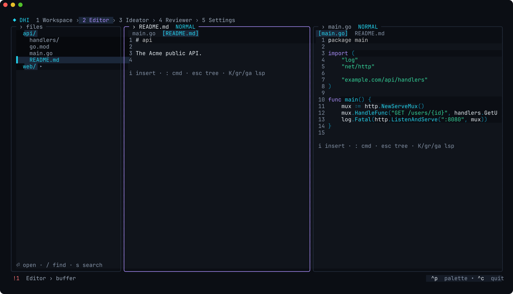 | 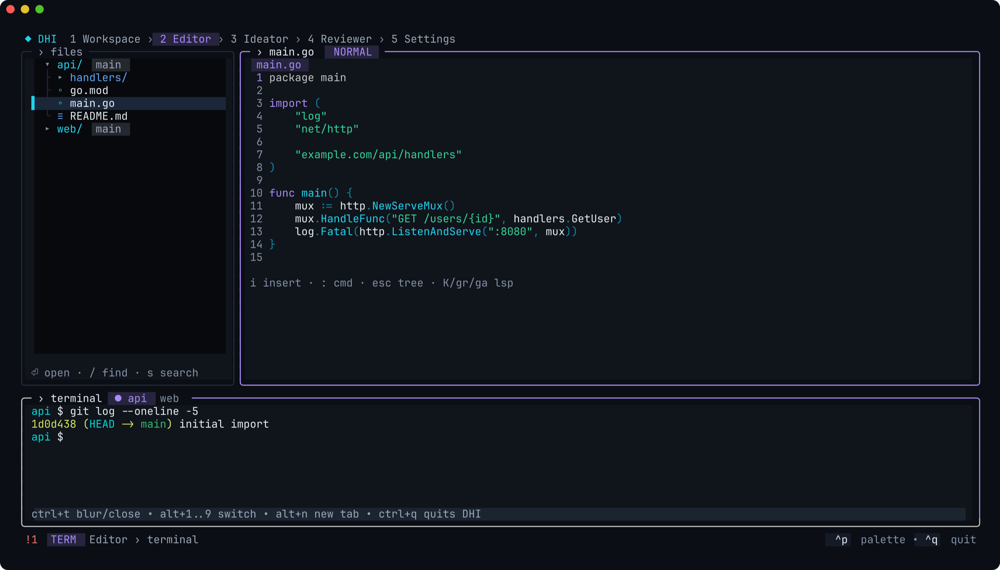 |
| **Project-wide regex replace, previewed** | **Ideator: round-table sessions** |
| 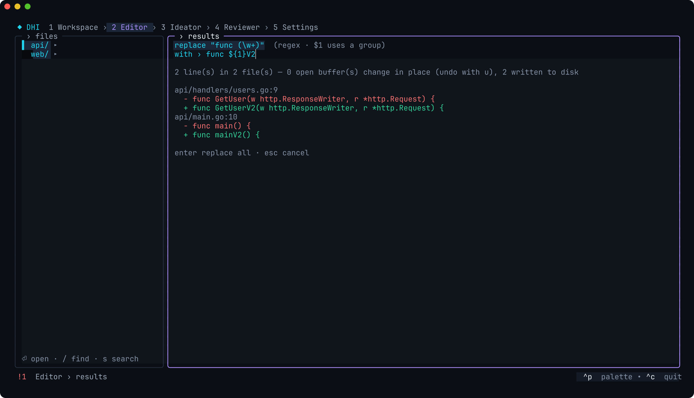 | 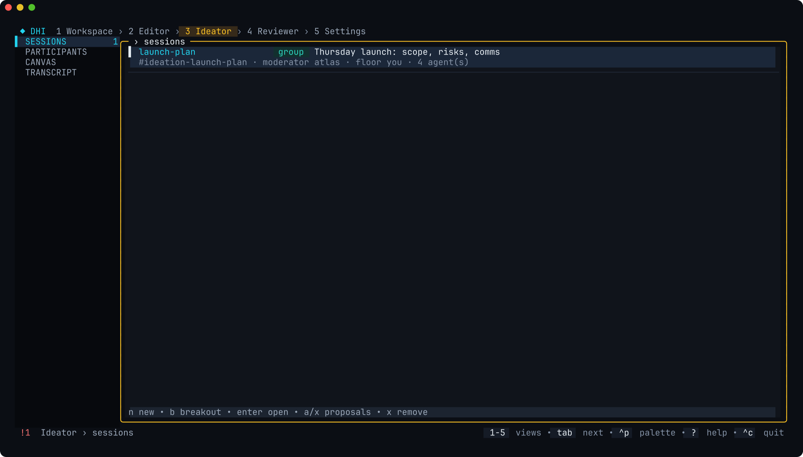 |
| **Settings, grouped** | **Help that follows you** |
| 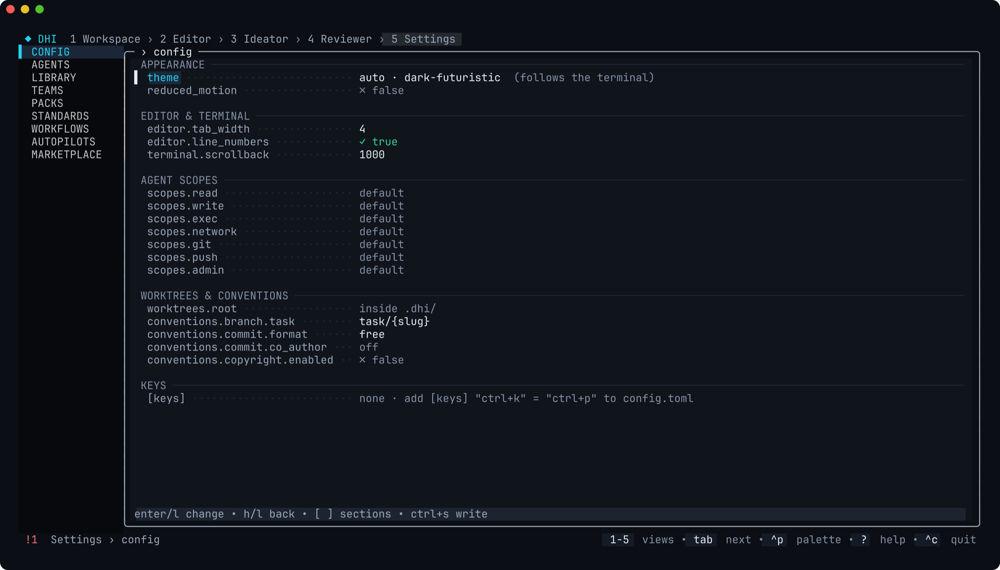 | 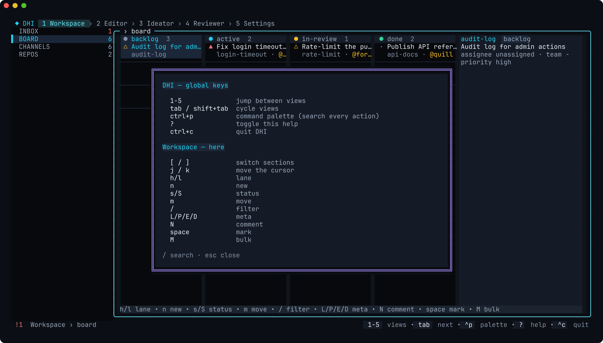 |
| **Narrow terminals get the full UI** | |
| 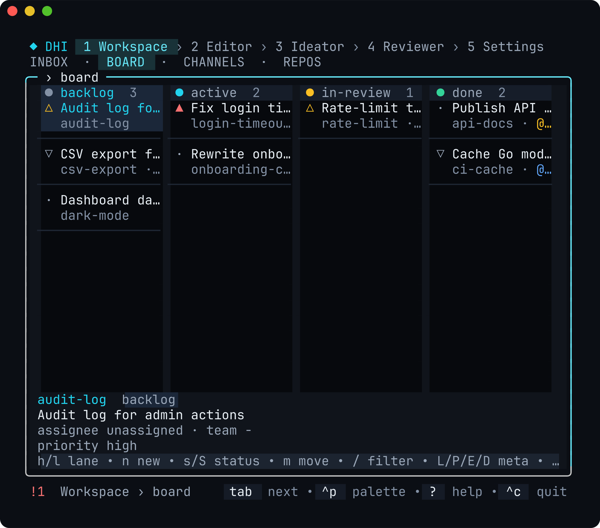 | |

## Install

**Script** (macOS and Linux):

```sh
curl -fsSL https://github.com/drjzlyan/dhi/releases/latest/download/install.sh | sh
```

The installer picks the build for your machine, **verifies its SHA-256** (and
its cosign signature when `cosign` is installed), and puts `dhi` in
`~/.local/bin` without sudo.

- Pin a version: `curl -fsSL …/install.sh | DHI_VERSION=0.2.0 sh`.
- Choose the folder: `… | DHI_INSTALL_DIR=/your/bin sh`.

**Homebrew** (macOS and Linux):

```sh
brew install drjzlyan/tap/dhi
```

The formula installs the same checksummed binary from the GitHub release.
Use one method, not both: a copy in `~/.local/bin` earlier on your `PATH`
hides the Homebrew one (`rm ~/.local/bin/dhi` if you switch to Homebrew).

**Platforms:** macOS (Apple silicon and Intel, macOS 12+) and Linux
(x86_64 and arm64). These are the platforms DHI pins a complete toolchain
for; others are refused at install time with the reason, rather than
failing on first run.

<details>
<summary>Build from source</summary>

```sh
git clone https://github.com/drjzlyan/dhi && cd dhi
go run ./cmd/dhi      # Go 1.26+
make verify           # fmt + vet + race tests
```
</details>

### Updating

```sh
# installed with the script: re-run it (it replaces the binary in place)
curl -fsSL https://github.com/drjzlyan/dhi/releases/latest/download/install.sh | sh

# installed with Homebrew
brew update && brew upgrade dhi

dhi version   # check what you have
```

Updating never touches your toolchain (`~/.local/share/dhi`), settings
(`~/.config/dhi`) or workspaces. Restart any running `dhi` to pick up the new
version. To go back to an older release, re-run the script with
`DHI_VERSION=<version>`.

## First run

```sh
cd your-project && dhi
```

1. **Toolchain.** DHI lists what it will download (about 157 MB: Go, Node,
   uv, ripgrep, git, gh) and where, then asks before installing. Everything
   lands in `~/.local/share/dhi`; delete that folder to uninstall.
2. **Setup.** A short wizard covers:
   - the workspace;
   - your git identity;
   - team conventions (commit format, branch names, co-author);
   - which coding agent to use;
   - a starter team.

   Skip anything; re-run it any time from `ctrl+p` → *Run setup wizard*.
3. **Learn by doing.** `ctrl+p` → *Tutorial* runs short lessons under the
   live UI; each step waits for you to do the real action.

Agents run on the coding CLI you already use: **Claude Code**, **Codex**,
**Cursor Agent**, **GitHub Copilot CLI**, **opencode** or **Antigravity**.
DHI detects it, installs most of them for you after asking, and keeps every
agent inside the workspace's tools, scopes and approvals.

## Keys

| Key | Does |
|---|---|
| `1`–`5`, `tab` | switch views: Workspace · Editor · Ideator · Reviewer · Settings |
| `[` `]` | switch sections inside a view |
| `ctrl+p` | command palette: search every action |
| `?` | help for where you are; `/` searches it |
| `n` | new task / session / review, depending on the view |
| `s`, `ctrl+r` | search the workspace; toggle regex |
| `ctrl+w v` | split the editor |
| `ctrl+t` | terminal drawer — vim, htop and friends run full screen |
| `ctrl+c` | quit |

Remap any key in `config.toml` (`[keys] "ctrl+k" = "ctrl+p"`); hints and help follow your keys.
`dhi version` prints the build; `dhi doctor` diagnoses an install.

## Docs

| | |
|---|---|
| [Product overview](docs/product.md) | vision, personas, the five views |
| [Architecture](docs/architecture.md) | modules and dependency rules |
| [Testing](docs/testing.md) | test pyramid, golden snapshots, the layout contract |
| [Decisions](docs/adr/) | architecture decision records |
| [Features](docs/features/) | one spec per feature, with acceptance criteria |
| [Roadmap](ROADMAP.md) | milestones, done and planned |

## Contributing

Bug reports, ideas and pull requests are welcome. See
[CONTRIBUTING.md](CONTRIBUTING.md) to get set up (`make verify` is the bar),
and please read the [Code of Conduct](CODE_OF_CONDUCT.md). To report a
security issue privately, follow [SECURITY.md](SECURITY.md).

## License

[MIT](LICENSE)
